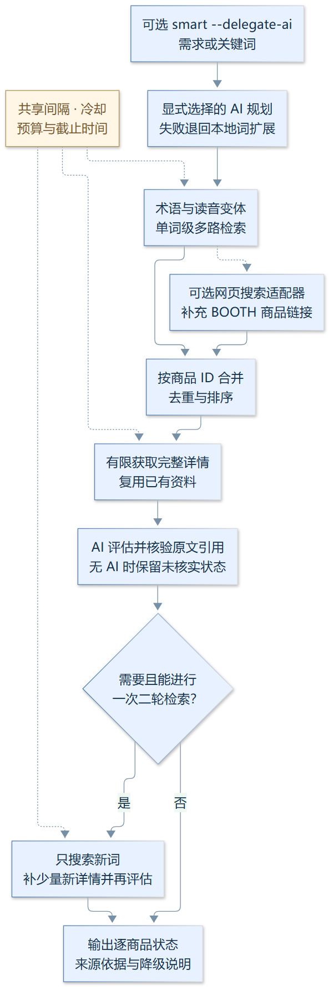

# booth-cli

Booth.pm（BOOTH 同人/VRChat 素材市场）的命令行搜索工具，为 AI agent 设计。
核心以 Python 标准库实现，唯一依赖 pykakasi（假名读音变体，`smart` 使用），
已安装为 `booth` 命令（`~/bin/booth` → 本目录 `booth.py`）。

运作原理、分层兜底思路、参考的开源项目与盲测方法论，见 [ARCHITECTURE.md](ARCHITECTURE.md)。

## 亮点

- **三链路搜索，统一收敛 VRChat 圈**：日文关键词直搜 / 中文需求 LLM 转译 /
  以图搜图（视觉模型读图生成关键词），三条链路默认全部收窄到 `VRChat` 标签圈。
- **小语种翻译不裸翻**：LLM 直译日语不可靠——借鉴 E 站（E-Hentai）AI 翻译本子类
  开源实践，以术语约束与写法规范驾驭模型：单词级关键词（Booth 多词 AND 匹配脆弱）、
  专有名词片假名完整转写、部位/用途行业词、假名读音与连写变体。
- **按商品说明提供适配证据**：「适用于XX素体的服装」类需求结合商品说明
  （対応素体/仕様 段落）排序，逐商品标注原文依据或未核实状态，实际适配仍以商品说明为准。
- **历史盲测记录**：每条链路盲抽 100 个 VRC 对口样本，目标准确率 ≥90%，
  跑测→改策略→复测。图文链路一测约 50% 撞上「艺术字干扰视觉 OCR」的瓶颈，
  接入 Exa 网络搜索与 LLM 自有知识库（知名模型/热门素材回忆）后二测突破到
  **93%**（JP 95% / ZH 100%）。这些历史结果未在当前版本复测；本轮验证见下文。
  中文泛称查询的多轮盲测记录（方法/词表/逐轮结果/证据）见 [benchmarks/](benchmarks/)。
- **每一层都有退路**：图搜引擎三级回落（Bing 纯 HTTP → 浏览器 → ascii2d → 派生词直搜）、
  `Retry-After` 感知退避重试、磁盘缓存 + 全局限速；smart 的 AI 主/兜底双后端
  （与 bot 同名环境变量）。所有降级如实告知用户。

## 1.5.1 更新

默认使用通用 API：填入 `AI_API_KEY + AI_BASE_URL` 自动发现模型，模型列表不可用时补填 `AI_MODEL`。支持 OpenAI 兼容、Anthropic 与 Gemini 协议，旧 VISION_* 兼容，新连接不继承旧模型名。网页搜索独立使用 `SEARCH_API_KEY + SEARCH_BASE_URL`，支持通用 JSON、Exa、Tavily、Brave、SearXNG 与自定义适配器，不绑定 OpenCode/GLM 或 Exa。配置与图片流程图见 [AI_SETUP.md](AI_SETUP.md)。

模型先通过随机合成图检测才开放图片功能；未配置、不支持或暂无法确认时，关闭所有图片搜索入口，只允许文字搜索。独立 `imgsearch` 在读取或下载用户图片之前执行检测，不绕过限制调用图片反查。

## 1.4.0 更新

共享 SQLite 请求预算覆盖同机子进程、重试和重定向；429/503 冷却同步到所有 CLI。缓存命中不消耗出站许可。默认间隔 1 秒；配置 BOOTH_REQUEST_BUDGET_DB 时，所有子进程必须使用同一个本地文件。

智能搜索在有上限的完整详情后评估来源，逐商品返回 relevance_status 与 relevance_evidence。商品名、品类、标签和说明均可作为相关性信息；说明中的关键词提及不保证适配。首轮最多补 6 件详情，二轮补 3 件新商品，默认出站上限 12/18。商品详情传 --desc-len -1 保留正文。

RUN_PROFILE=benchmark 默认关闭 AI，独立账号/配额准备好后才设置 BENCHMARK_ALLOW_AI=true。保留原有行业词表和保守重试；归档翻译函数未启用。详见 ARCHITECTURE.md。

## 创新点与实现原理

本项目的设计重点，是把 BOOTH 检索、跨语言术语、商品原文证据和请求成本控制组合成可供 AI agent 调用的流程。下面描述的是已经实现的机制。



[放大查看 SVG](docs/images/search-flow.svg)

### 1. 需求规划与行业词共同约束检索

AI 先决定是否翻译，并分别给出站内检索词与商品说明核实词；随后用固定行业词表、复合需求中的正向术语和 pykakasi 读音变体补齐日语表记。不同词分别检索，再按商品 ID 合并，减少把整句翻译成一个脆弱 AND 查询的问题。没有 AI 时使用原词分词和读音变体。二轮沿用相同归一流程，去掉已搜词，只保留最多三个新词。

实现入口：[smart_search.py](smart_search.py) 的 `plan_search`、`apply_industry_synonyms`、`expand_reading_variants`，以及 [booth.py](booth.py) 的 `cmd_smart`、`_merged_search`。

### 2. 把相关性判断绑定到商品原文

评估前最多为首轮六件商品补完整详情，二轮最多补三件新商品；保留未拉详情的候选，并记录 `detail_status`。评估输入含完整商品名、品类、标签、商品 ID、来源摘要哈希，以及最多 900 字符的说明摘录。摘录优先取核实词附近的段落，无命中时取正文首尾；完整说明留在本地供引用和否定条件检查。

模型的 `item_id + field + quote` 必须对应同一商品字段中的连续原文。带说明核实词的需求要求引用可用的 description；明确否定会阻止其作为支持证据。只有至少三条具有有效引用的命中，评估才可维持 `ok`，其余商品仍各自标为 `related / unsupported / unknown`。这能验证引用来源，相关性语义仍由模型判断，不能把关键词提及当作兼容性保证。

实现：[search_evidence.py](search_evidence.py) 的 `candidate_lines`、`grounded_evaluation`、`promote_evidence`；JSON 结果提供 `relevance_status` 与 `relevance_evidence`，供上层继续核查。

### 3. 一个查询的预算贯穿多个子进程

Bot 可通过 JSON context 传入 `request_id / max_requests / deadline`。各 CLI 进程为经 `http_get` 发出的 BOOTH 请求共用同一 SQLite 文件，以短暂的 `BEGIN IMMEDIATE` 事务核对请求间隔、共享冷却和剩余预算，并原子登记一次出站许可；事务外等待和联网，避免睡眠期间占住数据库写锁。

重试、重定向和详情请求都计入许可，HTTP 缓存命中不计入。默认请求间隔为 1 秒；独立 smart 查询默认首轮 12 次，二轮最多 18 次，扩展时保留已消耗计数及原截止时间。429/503 的有效 `Retry-After` 保存为同机共享冷却，超出可等待时间就明确返回。数据库不可用时返回错误，不绕过限制。

实现：[request_budget.py](request_budget.py) 的 `wait`、`cooldown`、`query_context`，接入 [booth.py](booth.py) 的 `http_get`。独立 smart 的默认 180 秒约束出站等待与许可；Bot 另负责完整任务的总超时。同机各进程须共用 `BOOTH_REQUEST_BUDGET_DB`，该机制不提供跨机器限流。

### 4. 从已有页面取候选，减少无效网络工作

规范搜索 URL 在查询已位于路径时不再重复传 q，显式传递新着等排序；人气排序翻页由 `effective_sort` 切到新着并说明。保留同页候选，标题命中用于排序而不作为删除依据；详情通过状态标记复用，展示阶段不再重复获取。

实现：[booth.py](booth.py) 的 `build_search_url`、`effective_sort`、`_enrich_details`。这类优化减少重定向和重复详情请求，并不增加自动抓取页数。

### 5. 结构化接口与可追踪的降级

`booth bot` 使用 `ok / action / data / error` 信封，并可附 `request_budget`；版本接口返回能力与语义指纹，让框架能校验母项目版本并识别业务源码变化。已知 GLM 文本模型通过 `structured_options` 设置 JSON 输出及相应推理参数，其他模型维持已有参数。仅配置备用 AI 也可工作，评估失败时保留候选和未核实状态。

实现：[booth.py](booth.py) 的 `cmd_bot`，接口约定见 [QQBOT.md](QQBOT.md)；AI 配置选择在 [smart_search.py](smart_search.py)，结构化参数在 [search_evidence.py](search_evidence.py)。

### 验证记录与适用范围

2026-10-02 的 1.5.1 / Bot 0.3.1 本地验证：CLI 149 项、Bot 169 项、母项目契约 6 项，共 324 项通过。覆盖三类 AI 协议、自动模型选择、能力未知/不支持时全部图片入口关闭、能力撤销、配置迁移、搜索协议与自定义适配器、认证不重定向、旧 key 隔离与 BOOTH 链接校验。随机图片检测不代表搜品准确率已复测。

2026-10-01 的 1.4.0 / Bot 0.2.0 配套验收：CLI 单元测试 103 项、Bot 单元测试 113 项、母项目契约测试 4 项，共 220 项通过；两仓库 Python 3.10 / 3.12 CI 通过。CLI 的并发预算测试使用真实子进程，见 [test_request_budget.py](tests/test_request_budget.py)；引用与否定条件测试见 [test_search_evidence.py](tests/test_search_evidence.py)。

线上内部“铃铛”查询单次耗时 19.9 秒，使用 12 个 BOOTH 请求，展示六件商品，其中三件有有效来源引用、三件未核实。该次验收没有人工发送 QQ 消息；本地三条抽查含已有 HTTP 缓存。它们不构成冷启动性能或整体准确率评测，历史 93% 记录未在这一版本重新证明。大规模评测应使用独立账号/配额；`RUN_PROFILE=benchmark` 默认禁止 AI，更换同账号 key 不等于配额隔离。

## 特性

- **智能搜索（VRC 对口，`booth smart`）**：中文/需求式描述直接入口——AI 产出单词级
  日语关键词 + 说明文核实词，分词多路合并搜索，「适用于XX素体的服装」类需求按
  商品**说明文**（対応素体/仕様 段落）匹配置顶；知名商品回忆与网络检索（DDG/Exa）
  兜底。策略与 [vrc-booth-bot](https://github.com/wuhutakeoffyoo/vrc-booth-bot) 同源。
  AI 读环境变量 `VISION_API_KEY/VISION_BASE_URL/VISION_MODEL`（与 bot 同名，一份 .env
  两边兼容；新配置用 `AI_API_KEY/AI_BASE_URL`），缺省自动降级为文字直搜。
- **关键词搜索 / 商品详情 / 商店查询**：结构化 `--json` 输出，为 AI agent 调用设计。
  search/smart **默认收窄 VRChat 圈**（自动 `--tag VRChat`，`--no-vrc` 搜全站）；
  popularity 排序翻页时自动切新着并标注（Booth 站点忽略 popularity 下的 page 参数）。
- **bot 接入钩子**：`booth bot` JSON 信封接口（子进程进出、退出码恒 0、永不抛栈），
  NoneBot/Koishi/Yunzai 等框架均可直接接，见 [QQBOT.md](QQBOT.md)；
  配套 NoneBot 实现：[vrc-booth-bot](https://github.com/wuhutakeoffyoo/vrc-booth-bot)（VRC 对口）。
- **以图找品（imgsearch）**：Bing 视觉搜索**纯 HTTP 快路径优先**（协议逆向自开源库
  [kitUIN/PicImageSearch](https://github.com/kitUIN/PicImageSearch)，约 2 秒、无浏览器），
  被区域风控拒绝时自动回落 playwright 浏览器引擎（有头 + 持久 profile 过 Cloudflare），
  另有 ascii2d 备援；引擎派生词（图内文字）自动合并进关键词搜索。
  必须先接入通过能力检测的多模态 API；检测未通过时不启用任何图片搜索引擎。
- **磁盘缓存**：sqlite 实现（借鉴 [requests-cache](https://github.com/requests-cache/requests-cache)），
  商品 6 小时 / 搜索页 10 分钟，重复查询瞬时返回；`--no-cache` 强制最新。
- **限流退避**：重试遵循 `Retry-After` 响应头，无头时指数退避 + 抖动
  （借鉴 [tenacity](https://github.com/jd/tenacity)），对 Booth 限流更友好。
- **安全边界**：仅允许 `https://*.booth.pm` 官方域名（重定向逐跳校验），Bing 端点主机白名单 +
  DNS 解析私网地址阻断（防 SSRF/DNS rebinding）。
- **测试**：`python -m unittest discover -s tests`，覆盖解析器/安全边界/缓存/退避/bot 钩子，不联网。

## 为什么自己写

Booth 无官方公开 API；调研过的开源项目（boothmate / BoothPM-SDK / gallery-dl / Booth2RSS / booth-manager）
都是给人写代码用的库或 RSS/下载工具，没有现成"给 AI agent 用的搜索 CLI/MCP"，故基于其验证过的
页面结构（搜索页 `li.item-card` data 属性、单品 `/ja/items/{id}.json`）实现。

## 数据来源（非官方接口）

| 用途 | 端点 |
|---|---|
| 搜索 | `https://booth.pm/ja/search/{query}` 或 `/ja/browse/{分类}` （HTML 内嵌商品卡片） |
| 单品 | `https://booth.pm/ja/items/{id}.json` |
| 商店 | `https://{sub}.booth.pm/items` （仅少量服务端渲染，见限制） |

年龄门用 cookie `adult=t` 绕过；R-18 由 `adult` 参数控制，默认 `include` **联合搜索**（Booth 的 R-18 为一元标记，情色与怪诞/R18G 类同旗、无独立过滤），结果里每件商品带 `is_adult` 标记。

## 用法

```bash
booth help                          # 帮助

# 智能搜索（VRC 对口推荐入口：中文/需求式描述 → AI 关键词 + 说明文核实 + 分词合并）
booth smart "适用于Rexouium素体的服装" --json
booth smart "尾巴" --no-ai --json    # 跳过 AI（分词+读音变体直搜）

# 搜索（默认收窄 VRChat 圈、新着序、联合 R-18）
booth search "VRChat アバター" --limit 10 --json
booth search "衣装" --no-vrc --json  # 搜全站

# 组合过滤
booth search "衣装" --sort popularity --min-price 1000 --max-price 5000 \
    --category "3D衣装" --in-stock --exclude "VRoid" --json

booth search "" --tag VRChat --tag アバター --adult only   # 标签/成人过滤

# 商品详情（含收藏数、标签、规格、简介、图片）
booth item 5813187 --json
booth item https://booth.pm/ja/items/5813187

# 商店信息与最新商品
booth shop mukumi --json

# 以图找品（先配置通过检测的多模态 API；再启用 Bing/ascii2d）
booth imgsearch 商品图.jpg --json
booth imgsearch "https://booth.pximg.net/..." --engine ascii2d --headless --json
```

所有命令支持 `--no-cache` 跳过磁盘缓存强制重新请求。

### search 选项

| 选项 | 说明 |
|---|---|
| `--sort` | `new`(新着) `popularity`(人气) `liked`(收藏) `price_asc` `price_desc` |
| `--type` | `all` / `digital`(下载品) / `physical`(实体) |
| `--adult` | `include`(默认，联合搜索) / `exclude`(仅全年齢) / `only`(仅R-18) |
| `--tag NAME` | 标签过滤，可多次；默认已自动收窄 VRChat（`--no-vrc` 搜全站） |
| `--or-word W` / `--exclude W` | OR 词 / 排除词，可多次 |
| `--min-price` / `--max-price` | 价格区间（日元） |
| `--in-stock` | 仅在售 |
| `--category SLUG` | 分类，需日语原文，如 `3Dキャラクター` `3D衣装` `3D小道具` `3D装飾品` `3Dテクスチャ` `3D髪型` `3D靴` `VRoid` |
| `--page N` / `--pages N` / `--limit N` | 翻页与条数（页间隔约 1.2s） |
| `--json` | 结构化 JSON 输出（AI 推荐） |

## 已知限制

- **无官方 API**，依赖页面结构，Booth 改版可能需要更新解析器。
- **imgsearch 的 Bing HTTP 快路径受区域影响**：部分网络环境下 Bing 会把视觉搜索结果页
  弹回首页（HTTP 路径拿不到结果，约 0.6 秒失败），此时自动回落 playwright 浏览器引擎；
  宽松网络环境下 HTTP 路径直接出结果且无需浏览器。
- `imgsearch` 浏览器备援依赖 playwright + 本机 Chrome；持久 profile
  `~/.booth-cli/pw_profile` 保存了通过验证的 cookie，**勿删除**（删除后首次运行需重新过验证）。
- `shop` 命令：多数商店的商品列表由前端 JS 加载，服务端只能渲染最新几件；
  找某店商品建议用 `search "店铺名"` 或已知商品 ID。
- 个别店铺（如 vrcalphabet）开了 Cloudflare 盾，无法抓取，会报错提示。
- 未登录功能（收藏/购物车/已购下载）不在此工具范围。
- 请遵守 Booth 利用条款：请求间隔 ≥1 秒，勿高并发抓取。

## 环境要求

Python 3.8+；安装依赖：`pip install -r requirements.txt`（pykakasi，假名读音变体，必装）。
Windows（Git Bash / CMD）与 Linux/macOS 均可运行。

## 部署与网络

CLI 是纯本地程序，部署在哪台机器都可以，关键是**网络能访问 booth.pm 与官方图床 pximg**——这两个域名在部分网络环境（如中国大陆）直连不可达或不稳定。

### 方式一：本地部署（推荐起步）

1. 安装 Python 3.8+ 与依赖：`pip install -r requirements.txt`；
2. 把本目录加入 PATH（或建 `booth` 别名指向 `booth.py`），运行 `booth search "猫耳" --json` 验证；
3. 网络不通时按下面的代理引导配置。

**Clash 代理引导（本地部署重点）**：

- 建议开启 **TUN 模式**（虚拟网卡全局接管）：CLI 以命令行子进程方式发起请求，
  不读取浏览器代理设置；TUN 模式在网络层接管全部流量，确保 python 子进程也走代理。
- 同时在规则（或全局规则组）中让以下域名走代理节点（建议日本等亚洲出口，
  延迟最低且 Bing 图搜快路径可用）：`booth.pm`、`booth.pximg.net`、`www.bing.com`（图搜）、
  `html.duckduckgo.com`（网络检索兜底）；`api.exa.ai` 与 AI 端点（`opencode.ai`/`open.bigmodel.cn` 等）直连或代理均可。
- 不使用 TUN 时，也可设置环境变量兜底：`HTTPS_PROXY=http://127.0.0.1:7890`
  （端口按你的 Clash 混合端口调整）——CLI 的网络层会读取该变量。

### 方式二：服务器部署

- **必须选择海外服务器**（日本等亚洲区域最佳）：booth.pm 与 pximg 需要海外直连，
  国内服务器上 pximg 不可达、Bing 图搜快路径会被弹回；海外服务器实测全链路免浏览器、秒级响应。
- 部署步骤、QQ bot 组网（协议端留国内 + 反向 WS）与历史实测记录见 [PROXY_DEPLOYMENT.md](PROXY_DEPLOYMENT.md)。

## AI Agent 技能文档

[skill/SKILL.md](skill/SKILL.md) 是给 AI agent 用的技能说明，沉淀了三套实战验证的流程：

1. **基础用法**——搜索/详情/商店的推荐调用方式（一律 `--json`）
2. **多商品对比**——三轴关键词探测 + 缺席检查 + 五层维度对比（事实/能力/成本/信号/结论）
3. **以图找品**——读图提词 → 两轴搜索取交集 → 下载商品图视觉比对（含 pximg Referer 与缩略图 URL 改写技巧）

安装方法：把 `skill/` 目录复制为各 agent 的技能目录下的 `booth/`（如 `~/.zcode/skills/booth`、`~/.agents/skills/booth`、`~/.codex/skills/booth`）。

## 许可证

MIT — 见 [LICENSE](LICENSE)。
