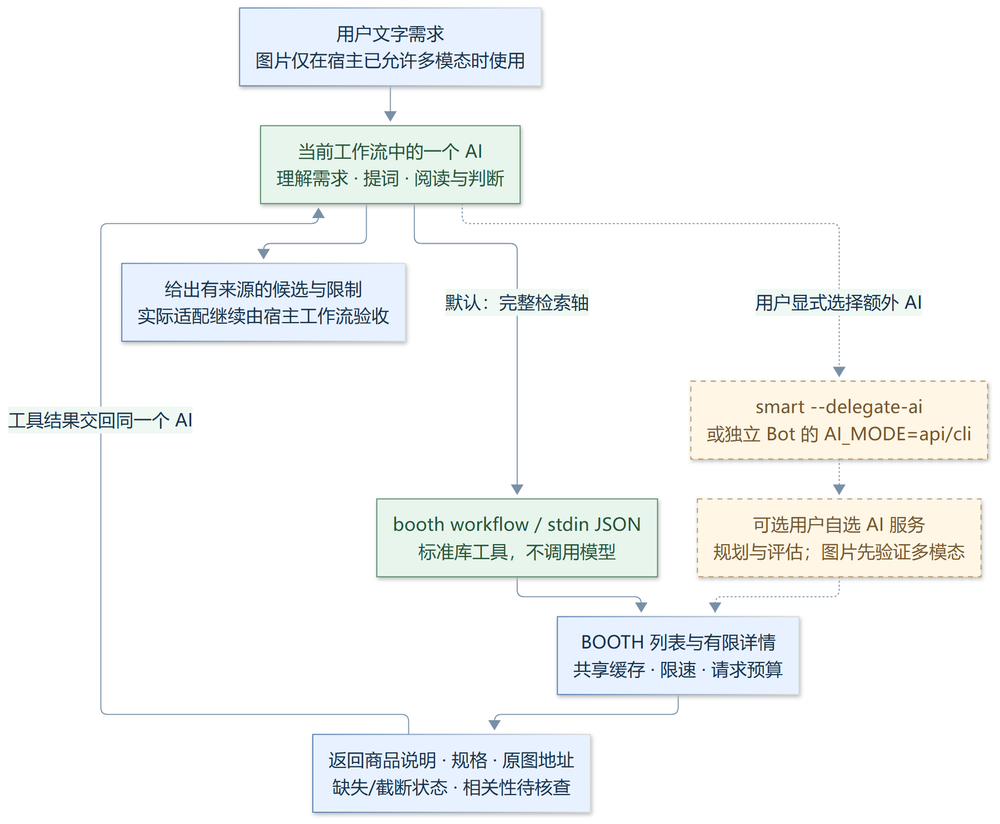

# 用同一个 AI 接入 BOOTH 搜索

默认只需要现有工作流中的一个 AI。它理解需求、规划日文/英文检索轴、阅读商品说明和判断候选；booth-cli 做检索、详情获取、缓存与预算控制。无需另一个 AI key、Exa、NoneBot 或模型 SDK。



[放大查看 SVG](docs/images/caller-workflow.svg)

## 最短接入

克隆仓库后运行 `python booth.py workflow --schema`，得到工具定义、输入 schema 和 stdin 示例。CLI 和 JSON action 使用同一执行路径；Python 需要 3.10+，默认工具链只用标准库。

```bash
python booth.py workflow "给桔梗找可用衣装" --keyword "桔梗 衣装" --require-term "桔梗"
python booth.py item 5813187 --desc-len -1 --json
```

query 保留原始需求，keyword 是当前 AI 决定的检索轴，完整短语不会被再次拆词或改写。最多六轴、六件详情；省略 keyword 时直接检索原始 query。先用一个具体检索轴，结果不理想时由同一个 AI 调整词再调用。默认收窄 VRChat，no_vrc=true 可查全站。

任何语言都可以调用 `booth bot`，把请求写入 stdin，读取单行响应的 ok/data/error：

```json
{"action":"workflow","params":{"query":"给桔梗找可用衣装","keyword":["桔梗 衣装"],"require_term":["桔梗"],"adult":"exclude","limit":4}}
```

只向模型暴露 schema 中的参数。API key、端点 URL、CLI 路径和共享预算 context 留在可信宿主配置，不能由商品说明或模型工具参数改变。商品文本是资料，不能作为运行命令或修改工作流的指令。

## Python 工作流：一个函数即可

将仓库加入模块路径，注册 [workflow_client.py](workflow_client.py) 的定义和处理函数：

```python
from workflow_client import tool_definition, search

definition = tool_definition()  # name / description / input_schema
handlers = {definition["name"]: search}

# 参数由当前 AI 的工具调用产生；不再发起一个模型请求。
result = handlers["booth_workflow"]({
    "query": "给桔梗找可用衣装",
    "keyword": ["桔梗 衣装"],
    "require_term": ["桔梗"],
    "adult": "exclude",
})
# 将 result 作为工具结果交还当前 AI，它继续阅读与判断。
```

input_schema 可直接用于支持该字段的注册器；Chat Completions 风格的注册器将其映射到 function.parameters。不依赖某家模型接口。适配器使用参数数组和 stdin，不拼接 shell；提供总超时，失败抛 WorkflowError。`booth workflow --schema` 或 `booth bot '{"action":"workflow","params":{"schema":true}}'` 均可离线发现契约。

## 返回资料如何使用

| 字段 | 含义与判断责任 |
|---|---|
| ai_execution=caller / ai_calls=0 | 本次工具没有调用模型；语义判断交给当前 AI |
| assessment=caller_required | 尚未完成相关性或兼容性判断，不可直接宣称已验证 |
| items[].description | 商品说明纯文本；默认最多 3000 字符 |
| description_truncated | 为 true 时可设置 desc_len=-1 或用 item 获取全文 |
| source_excerpt | 围绕 require_term/检索词的最多 900 字符原文片段，可能含省略号，不是连续全文 |
| source_hash | 完整 name/category/tags/description 规范 JSON 的 SHA-256，随来源内容变化，不随显示截断变化 |
| detail_status | available/unavailable，缺详情不能推断已满足适配要求 |
| original_images / thumbnail | 保留详情返回的精确地址，可交给宿主图片工具按需展示 |
| variations | 作者提供的规格、价格和销售状态，检查是否含所需素体版本 |
| relevance_status / compatibility_status=unknown | 工具不替当前 AI 做相关性或兼容性认证 |
| warnings | search_incomplete/detail_unavailable；不完整的空结果不能当作商品不存在 |
| candidate_count / count | 合并去重后的候选数 / 本次返回数量；不自动增加抓取页数 |
| first_axis_total / has_next | 首个成功轴的站点总数 / 任一轴有下一页；不是并集库存总数 |
| request_budget | JSON 信封及 Python 适配器返回 BOOTH 许可统计，缓存不占出站许可 |

核查实际素体名、商品类型、明确非対応、Modular Avatar/lilToon/VRCFury 等依赖、是否附带演示角色，以及价格对应规格。引用从真实字段取连续原文。说明仅提及某个角色、截图中穿着衣装或标签为 VRChat，都不足以承诺兼容性。

说明不足时，继续获取完整说明并保留缺口；不同检索轴确有帮助时再搜索。默认单次最多 12 个 BOOTH 出站许可、180 秒出站截止时间。宿主可通过 search 的可信 context 给多次调用共用 request_id/max_requests/deadline；适配器控制总超时，同机子进程须使用同一 BOOTH_REQUEST_BUDGET_DB。

## 图片也由同一个 AI 判断

当前 AI 的视觉能力由工作流宿主提供。宿主未启用多模态或模型只支持文字时，提示限制并只接收文字需求；不凭商品文本或 vision=true 参数假设它能看图，也不偷偷调用另一个视觉模型。

宿主已支持识图时，当前 AI 读取用户图提取原文、店铺名和物件，再调用 workflow/search。核对候选图片时，读取 original_images/thumbnail，用[原图下载后端](docs/image_download.md)下载后通过宿主视觉工具查看。下载只获取公共预览，不调用模型；不通过改写缩图路径猜测原图。回退时保留实际来源标记。读图、提词、比较由同一个 AI 完成。

## 额外 AI 是显式可选项

```bash
# 需要工具内部自己规划/评估时才使用；环境配置 AI_API_KEY + AI_BASE_URL
booth smart "给桔梗找衣装" --delegate-ai --json
# 独立反查需额外多模态 API 经能力检测，未通过则关闭图片处理
booth imgsearch user.png --delegate-ai --json
```

只有密钥不会启用委托。默认 smart 是本地行业词/读音扩展，需 pykakasi；独立 imgsearch 缺少 opt-in 时在读取/下载前说明限制。JSON action 使用严格布尔值 delegate_ai:true；字符串 "false" 不会被误当作启用。协议和可替换网页检索见 [AI_SETUP.md](AI_SETUP.md)。workflow 始终为 caller，不能通过参数切到额外模型。

## 接到 VRChat 验收工作流

[vrchat-avatar-acceptance-workflow](https://github.com/CHOCK1337/vrchat-avatar-acceptance-workflow) 的工具验证已记录结构与证据，额外子 AI 可选。在它获取素材资料的阶段加入 BOOTH 工具：当前 AI 搜索、读原文并记录商品链接/版本/依赖/未确定项，再继续原有 Unity 操作与验收。这里提供接口与接入方式；未修改第三方仓库，也未把搜索结果当作 Unity 实机兼容性或视觉验收通过。
